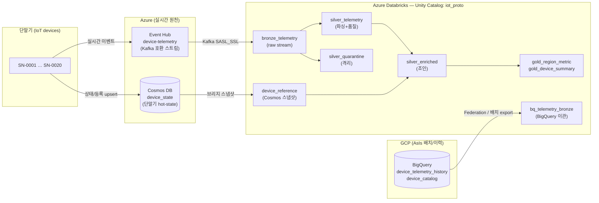

# BigQuery → Databricks · Event Hub / Cosmos DB 실시간 원천 프로토타입

> **실제** Azure · GCP · Databricks 리소스로 **구축·실행·검증**한 프로토타입입니다.
> 모든 데이터는 **중립 IoT 단말기 텔레메트리 샘플**이며, 고객 정보·실데이터·특정 도메인 내용은 포함하지 않습니다.

이 문서는 두 종류의 원천을 하나의 Databricks 메달리온으로 통합하는 컨셉을, 샘플 스키마와 실측 결과로 제시합니다.

- **Part A — 배치/이력 원천**: GCP **BigQuery** → Databricks (Lakehouse Federation · 배치 export→적재)
- **Part B — 실시간 원천**: Azure **Event Hub**(이벤트 스트림) + **Cosmos DB**(단말기 상태) → **Lakeflow SDP** 스트리밍

---

## 목차

- [1. 개요 및 실증 요약](#1-개요-및-실증-요약)
- [2. 전체 아키텍처](#2-전체-아키텍처)
- [3. 샘플 스키마 (중립 IoT)](#3-샘플-스키마-중립-iot)
- [4. Part A — BigQuery → Databricks](#4-part-a--bigquery--databricks)
  - [4.1 두 이관 방식 비교](#41-두-이관-방식-비교)
  - [4.2 Lakehouse Federation (제로카피 라이브)](#42-lakehouse-federation-제로카피-라이브)
  - [4.3 배치 export → UC Volume → Delta](#43-배치-export--uc-volume--delta)
  - [4.4 실측 결과](#44-실측-결과)
- [5. Part B — Event Hub + Cosmos → SDP](#5-part-b--event-hub--cosmos--sdp)
  - [5.1 왜 Event Hub + Cosmos 조합인가](#51-왜-event-hub--cosmos-조합인가)
  - [5.2 SDP 파이프라인 구조](#52-sdp-파이프라인-구조)
  - [5.3 Event Hub Kafka 스트리밍 소스](#53-event-hub-kafka-스트리밍-소스)
  - [5.4 데이터 품질 규칙 & 격리](#54-데이터-품질-규칙--격리)
  - [5.5 Cosmos 조인 (브리지 패턴)](#55-cosmos-조인-브리지-패턴)
  - [5.6 실측 결과](#56-실측-결과)
- [6. 재현 가이드](#6-재현-가이드)
- [7. 기능 갭 & 운영 고려사항](#7-기능-갭--운영-고려사항)
- [8. 부록 — 리소스 인벤토리 & 산출물 맵](#8-부록--리소스-인벤토리--산출물-맵)

---

## 1. 개요 및 실증 요약

단말기(device)에서 나오는 데이터는 성격이 둘로 나뉩니다.

| 성격 | 예시 | 적합 원천 | 처리 방식 |
|---|---|---|---|
| **이력/분석용 대용량** | 과거 30일 텔레메트리, 집계 기반 warehouse | BigQuery(AsIs) → Delta | 배치 이관(replatform) |
| **실시간 스트림** | 지금 들어오는 이벤트, 단말기 최신 상태 | Event Hub + Cosmos DB | SDP 스트리밍 |

본 프로토타입은 이 둘을 **동일한 단말기 모델(SN-0001~SN-0020)** 로 연결하여, 하나의 Unity Catalog 스키마(`adb_wrkspc_krc_dev.iot_proto`) 안에서 메달리온으로 수렴시킵니다.

**실증 요약 (모두 실제 실행·검증됨)**

| # | 항목 | 결과 |
|---|---|---|
| A-1 | BigQuery 샘플 warehouse 구축 | `device_telemetry_history` 2,400행 · `device_catalog` 20행 (asia-northeast3) |
| A-2 | Lakehouse Federation 라이브 조회 | 연결·Foreign Catalog 생성 → BigQuery **데이터 이동 없이** count 2,400/20 조회 성공 |
| A-3 | 배치 export → Delta 이관 | BigQuery 2,400행 → **Delta 2,400행 정확히 일치** (UC Volume 랜딩 → `read_files`) |
| B-1 | Azure 리소스 프로비저닝 | Event Hub Namespace/Hub, Cosmos DB(account/db/container) — SP로 자동 생성 |
| B-2 | 단말기 샘플 주입 | Event Hub **600 이벤트**(정상 563 + 불량 37), Cosmos **20 단말기 상태** |
| B-3 | SDP 스트리밍 파이프라인 | Event Hub Kafka 스트림 → medallion 실행 성공(serverless) |
| B-4 | 데이터 품질/격리 | bronze 600 → **silver 563 + 격리 37** (주입 불량과 정확히 정합) |
| B-5 | Cosmos 조인 enrichment | region/model/status 조인 성공, gold 집계 산출 |

---

## 2. 전체 아키텍처



| 구성요소 | 역할 | 본 PoC 구현 |
|---|---|---|
| **Event Hub** | 실시간 이벤트 버퍼·재생(replay) 가능한 로그. Kafka 프로토콜 호환 | `ehns-iotproto-kc22` / `device-telemetry` (2 파티션) |
| **Cosmos DB** | 단말기 최신 상태(hot-state)·참조 정보 저장(OLTP·NoSQL) | `cosmos-iotproto-kc22` / `iotdb` / `device_state` |
| **Lakeflow SDP** | 선언형 스트리밍 파이프라인, medallion·품질·CDC | `iot_proto_eventhub_sdp` (serverless) |
| **Unity Catalog** | 카탈로그·거버넌스·계보. Federation으로 BigQuery까지 통합 | `adb_wrkspc_krc_dev.iot_proto` |
| **BigQuery** | AsIs 이력 warehouse | `myproject-493803.iot_proto` |

---

## 3. 샘플 스키마 (중립 IoT)

단말기는 환경 센서(온도/습도/CO₂/진동)를 보고하는 가상의 IoT 기기입니다.

**① Event Hub 이벤트 (실시간 텔레메트리, JSON)**

```json
{
  "device_id": "SN-0007",
  "event_ts": "2026-07-29T10:23:45.123456+00:00",
  "metric": "temperature",         // temperature | humidity | co2 | vibration
  "value": 23.4,
  "unit": "C",
  "battery_pct": 86,
  "rssi": -72,
  "seq": 1421
}
```

**② Cosmos DB `device_state` (단말기 참조/hot-state)**

```json
{
  "id": "SN-0007",                  // Cosmos 필수 키
  "device_id": "SN-0007",           // partition key (/device_id)
  "model": "EnvSense-X2",           // EnvSense-X2 | EnvSense-X3 | AirNode-Pro
  "firmware": "2.4.1",
  "region": "KR-Seoul",             // KR-Seoul | KR-Busan | JP-Tokyo | US-East
  "site": "Plant-A",
  "status": "active",               // active | inactive
  "registered_at": "2025-08-…",
  "last_seen": "2026-07-29T…",
  "battery_pct": 87
}
```

**③ BigQuery `device_telemetry_history` (이력 사실 테이블, `ingest_date` 파티션)**

| 컬럼 | 타입 | 설명 |
|---|---|---|
| device_id | STRING | 단말기 ID |
| event_ts | TIMESTAMP | 관측 시각 |
| metric | STRING | 측정 항목 |
| value | FLOAT | 측정값 |
| unit | STRING | 단위 |
| battery_pct | INTEGER | 배터리 % |
| ingest_date | DATE | 파티션 키 |

`device_catalog`(차원): `device_id, model, region, install_date`.

---

## 4. Part A — BigQuery → Databricks

### 4.1 두 이관 방식 비교

전체 이관 프로젝트의 방향(BigQuery→Databricks)에서, 표준 접근은 두 가지입니다. 본 PoC는 **둘 다** 실증했습니다.

| 방식 | 데이터 이동 | 용도 | 장점 | 제약 |
|---|---|---|---|---|
| **Lakehouse Federation** | 없음(제로카피, 라이브 쿼리) | 이관 초기 병행운영·검증, 소량 참조 | 즉시 연결, BigQuery를 UC 테이블처럼 조회, pushdown | 전량 대용량 read는 BigQuery Storage Read API 권한(`bigquery.readSessionUser`) 필요 |
| **배치 export → 적재** | 있음(1회성 복제) | 실이관(replatform), 대용량 | Delta 네이티브 성능·비용, 원천 의존 제거 | 스냅샷 시점 관리·증분 설계 필요 |

**권장 전략**: Federation으로 **병행운영 기간 동안 검증**하고, 배치 export로 **실제 데이터를 Delta에 안착**시킨 뒤 컷오버.

### 4.2 Lakehouse Federation (제로카피 라이브)

Unity Catalog **Connection**(BigQuery) + **Foreign Catalog** 을 생성하면 BigQuery 테이블을 `카탈로그.데이터셋.테이블` 3단계로 **직접 조회**합니다. (코드: [`realtime_source_proto/06_federation_setup.py`](realtime_source_proto/06_federation_setup.py))

```sql
-- (API로 생성) UC Connection: BigQuery SA 키를 자격증명으로 사용
-- CREATE CONNECTION bq_iot_conn TYPE bigquery OPTIONS (GoogleServiceAccountKeyJson '{…}');
-- Foreign Catalog: BigQuery 프로젝트 매핑 (옵션명은 dataProjectId)
-- CREATE FOREIGN CATALOG bq_iot_fed USING CONNECTION bq_iot_conn OPTIONS (dataProjectId 'myproject-493803');

SELECT count(*) FROM bq_iot_fed.iot_proto.device_telemetry_history;  -- → 2400 (pushdown, 데이터 이동 없음)
SELECT count(*) FROM bq_iot_fed.iot_proto.device_catalog;            -- → 20
```

> **실측 확인**: 집계 pushdown 조회 성공(2,400 / 20). 전량 `SELECT *` 는 SA에 `roles/bigquery.readSessionUser` 부여 시 활성화됩니다(§7).

### 4.3 배치 export → UC Volume → Delta

실이관 경로입니다. BigQuery에서 추출한 데이터를 **UC Volume(오브젝트 스토리지 랜딩)** 에 두고 `read_files`로 Delta에 적재합니다 — 실제 GCS export → COPY INTO 패턴을 UC Volume으로 재현. (코드: [`realtime_source_proto/07_bq_export_load.py`](realtime_source_proto/07_bq_export_load.py))

```sql
CREATE VOLUME IF NOT EXISTS adb_wrkspc_krc_dev.iot_proto.landing;
-- (로컬 export한 NDJSON을 Volume에 업로드 후)
CREATE OR REPLACE TABLE adb_wrkspc_krc_dev.iot_proto.bq_telemetry_bronze AS
SELECT device_id, CAST(event_ts AS TIMESTAMP) event_ts, metric, CAST(value AS DOUBLE) value,
       unit, CAST(battery_pct AS INT) battery_pct, CAST(ingest_date AS DATE) ingest_date
FROM read_files('/Volumes/adb_wrkspc_krc_dev/iot_proto/landing/bq_telemetry.json', format=>'json');
```

### 4.4 실측 결과

```
BigQuery(원천)                 →  Delta(이관 후)
device_telemetry_history 2400  →  bq_telemetry_bronze  2400   ✅ 정확히 일치
device_catalog             20  →  bq_device_catalog      20   ✅

region 집계 (Delta 조인: bronze ⋈ catalog)
  JP-Tokyo   readings=711  avg=304.14
  KR-Seoul   readings=709  avg=281.50
  KR-Busan   readings=621  avg=311.95
  US-East    readings=359  avg=314.95
```

---

## 5. Part B — Event Hub + Cosmos → SDP

### 5.1 왜 Event Hub + Cosmos 조합인가

| 질문 | 답 |
|---|---|
| Event Hub 없이 단말기→Databricks 직접 적재하면? | 가능하지만 **버퍼·재생·다중소비**가 사라짐. 스파크가 죽거나 재배포 중이면 이벤트 유실. Event Hub는 **로그**로서 오프셋 재생을 보장 |
| Kafka/Event Hub의 상태 관리? | 브로커는 **stateless 로그**(오프셋만). "지금 단말기 상태"는 별도 저장소 필요 |
| 그 별도 저장소가 Cosmos | 단말기 **최신 상태/등록정보(hot-state)** 를 낮은 지연으로 read/write. 스트림에는 이벤트만, 상태는 Cosmos |

즉 **Event Hub = 흐르는 이벤트(fact stream)**, **Cosmos = 현재 상태(reference)**. SDP는 스트림을 처리하며 Cosmos 참조로 **enrichment** 합니다.

### 5.2 SDP 파이프라인 구조

(코드: [`realtime_source_proto/04_sdp_eventhub_pipeline.py`](realtime_source_proto/04_sdp_eventhub_pipeline.py))

```
Event Hub ──(kafka)──▶ bronze_telemetry ──┬─▶ silver_telemetry (품질통과)  ──┐
                                          └─▶ silver_quarantine (격리)        │
Cosmos ──(브리지 스냅샷)─▶ device_reference ─────────────────────────────────┤
                                                                    silver_enriched (조인)
                                                                             │
                                              gold_region_metric · gold_device_summary
```

| 테이블 | 유형 | 설명 |
|---|---|---|
| `bronze_telemetry` | Streaming Table | Event Hub 원천 raw(JSON 문자열 + 오프셋/파티션/enqueue 시각) |
| `silver_telemetry` | Streaming Table + `expect_all_or_drop` | JSON 파싱 + 3개 품질규칙 통과분 |
| `silver_quarantine` | Streaming Table | 규칙 위반 이벤트 + 사유(quarantine_reason) |
| `silver_enriched` | Streaming Table | 텔레메트리 ⋈ Cosmos 참조 (stream-static join) |
| `gold_region_metric` | Materialized View | region×metric 집계 |
| `gold_device_summary` | Materialized View | 단말기별 요약 + Cosmos status |

### 5.3 Event Hub Kafka 스트리밍 소스

Event Hub는 **Kafka 엔드포인트**(`:9093`, SASL_SSL/PLAIN)를 제공하므로 **커스텀 라이브러리 없이** Spark 내장 kafka 소스로 읽습니다. 연결문자열은 **Databricks Secret**에서 로드합니다.

```python
BOOTSTRAP = "ehns-iotproto-kc22.servicebus.windows.net:9093"
CONN = dbutils.secrets.get("iot_proto", "eh_conn_str")
JAAS = ('kafkashaded.org.apache.kafka.common.security.plain.PlainLoginModule '
        f'required username="$ConnectionString" password="{CONN}";')

@dlt.table(name="bronze_telemetry")
def bronze_telemetry():
    return (spark.readStream.format("kafka")
        .option("kafka.bootstrap.servers", BOOTSTRAP)
        .option("subscribe", "device-telemetry")
        .option("kafka.security.protocol", "SASL_SSL")
        .option("kafka.sasl.mechanism", "PLAIN")
        .option("kafka.sasl.jaas.config", JAAS)
        .option("startingOffsets", "earliest")
        .load().select(F.col("value").cast("string").alias("raw_json"),
                       F.col("partition").alias("eh_partition"),
                       F.col("offset").alias("eh_offset"),
                       F.col("timestamp").alias("eh_enqueued_ts")))
```

### 5.4 데이터 품질 규칙 & 격리

metric별 물리 유효범위를 기준으로 3개 규칙을 적용, 통과분은 silver·위반분은 quarantine으로 분기합니다.

```python
RANGE_EXPR = ("value IS NOT NULL AND ("
              "(metric='temperature' AND value BETWEEN -50 AND 100) OR "
              "(metric='humidity'    AND value BETWEEN 0 AND 100) OR "
              "(metric='co2'         AND value BETWEEN 300 AND 5000) OR "
              "(metric='vibration'   AND value BETWEEN 0 AND 100))")
RULES = {"valid_device_id":"device_id IS NOT NULL",
         "value_in_metric_range": RANGE_EXPR,
         "battery_non_negative":"battery_pct >= 0"}

@dlt.table(name="silver_telemetry")
@dlt.expect_all_or_drop(RULES)
def silver_telemetry(): ...
```

### 5.5 Cosmos 조인 (브리지 패턴)

**서버리스 SDP는 커스텀 커넥터 JAR 제약**이 있어, 본 PoC는 Cosmos hot-state를 **스냅샷으로 Delta 참조테이블(`device_reference`)** 에 반영한 뒤 stream-static 조인합니다. (코드: [`realtime_source_proto/03_cosmos_to_delta.py`](realtime_source_proto/03_cosmos_to_delta.py))

```python
@dlt.table(name="silver_enriched")
def silver_enriched():
    tele = dlt.read_stream("silver_telemetry")
    ref  = spark.read.table("adb_wrkspc_krc_dev.iot_proto.device_reference")   # Cosmos 스냅샷
    return tele.join(F.broadcast(ref), "device_id", "left").select(...)
```

> **운영 대안**: 실시간 상태 변화까지 CDC로 받으려면 **클래식 컴퓨트 + Azure Cosmos DB Spark 커넥터**의 **Change Feed 스트리밍**(`cosmos.oltp.changeFeed`)을 사용합니다(§7).

### 5.6 실측 결과

```
① 메달리온 행수 (Event Hub 600 이벤트)
   bronze_telemetry   = 600
   silver_telemetry   = 563     (품질 통과)
   silver_quarantine  =  37     (격리)
   silver_enriched    = 563     (Cosmos 조인 후)

② 격리 사유별 — 주입한 불량과 정확히 일치
   value_out_of_range   14
   null_device_id       12
   negative_battery      11        (합계 37)

③ 품질 expectations (event_log)
   valid_device_id         failed = 12
   battery_non_negative    failed = 11
   value_in_metric_range   failed = 14

④ Cosmos 조인 — region별 (enrichment 성공)
   KR-Seoul  readings=243  devices=8
   JP-Tokyo  readings=137  devices=5
   US-East   readings=133  devices=5
   KR-Busan  readings= 50  devices=2

⑤ gold_region_metric (상위)
   region    metric       reads   avg      min     max      avg_batt
   KR-Seoul  co2            77   1097.70  411.8  1967.29    55.4
   KR-Seoul  temperature   65     26.01   -9.69    59.21    56.9
   KR-Seoul  humidity      51     49.41    0.29    98.24    53.8
   KR-Seoul  vibration     50     25.55    0.47    49.50    55.5
```

`bronze 600 = silver 563 + 격리 37`, 그리고 격리 37 = 주입 불량(14+12+11)과 **완전 정합**. metric별 범위 규칙으로 gold의 물리값도 정상 범위(습도 ≤100, 진동 ≤50)로 수렴했습니다.

---

## 6. 재현 가이드

> 자격증명은 리포에 포함하지 않습니다. 로컬 `.secrets/`(Azure SP·GCP SA) + Databricks Secret으로 주입합니다.

**사전 준비**: Azure SP(Contributor), GCP SA(BigQuery), Databricks CLI(profile), `pip install azure-eventhub azure-cosmos google-cloud-bigquery`.

```bash
# ── Part B: Azure 리소스 ──
az group create -n rg-iot-proto -l koreacentral
az eventhubs namespace create -n <EHNS> -g rg-iot-proto --sku Standard
az eventhubs eventhub create  -n device-telemetry --namespace-name <EHNS> -g rg-iot-proto --partition-count 2
az cosmosdb create -n <COSMOS> -g rg-iot-proto --locations regionName=koreacentral --capabilities EnableServerless
az cosmosdb sql database  create -a <COSMOS> -g rg-iot-proto -n iotdb
az cosmosdb sql container create -a <COSMOS> -g rg-iot-proto -d iotdb -n device_state --partition-key-path /device_id

# ── 샘플 주입 ──
python realtime_source_proto/01_inject_cosmos.py       # Cosmos 20 단말기
python realtime_source_proto/02_inject_eventhub.py     # Event Hub 600 이벤트

# ── Databricks: 시크릿·브리지·SDP ──
databricks secrets create-scope iot_proto
databricks secrets put-secret  iot_proto eh_conn_str   # Event Hub 연결문자열
python realtime_source_proto/03_cosmos_to_delta.py     # Cosmos → device_reference(Delta)
python realtime_source_proto/run_pipeline.py           # SDP 노트북 업로드→생성→실행
python realtime_source_proto/verify_pipeline.py        # 검증

# ── Part A: BigQuery → Databricks ──
python realtime_source_proto/05_bq_sample.py           # BigQuery 샘플 warehouse
python realtime_source_proto/06_federation_setup.py    # Federation(라이브)
python realtime_source_proto/07_bq_export_load.py      # 배치 export → Delta
```

---

## 7. 기능 갭 & 운영 고려사항

| # | 항목 | 내용 / 대응 |
|---|---|---|
| 1 | **서버리스 SDP 커스텀 JAR 제약** | Cosmos Spark 커넥터(JAR)를 서버리스에 못 올림 → 본 PoC는 **브리지 스냅샷**으로 우회. 실시간 상태 CDC가 필요하면 **클래식 컴퓨트 파이프라인 + Cosmos 커넥터 Change Feed**(`spark.readStream.format("cosmos.oltp.changeFeed")`) |
| 2 | **Cosmos 역할 결정** | (a) 단순 참조 enrichment → 스냅샷 브리지로 충분 / (b) 상태변화 자체가 이벤트 → Change Feed 스트리밍 원천으로 승격 |
| 3 | **Federation 전량 read 권한** | `SELECT *`(Storage Read API)에는 SA에 `roles/bigquery.readSessionUser` 필요. 집계 pushdown은 불필요 |
| 4 | **Secret 관리** | 연결문자열/키는 **Databricks Secrets** 또는 **Azure Key Vault-backed scope**로. 코드/리포에 평문 금지(본 PoC 준수) |
| 5 | **정확히 한 번(Exactly-once)** | Event Hub→SDP는 kafka 오프셋 + Delta 트랜잭션으로 재처리 안전. `checkpoint`는 SDP가 테이블별 자동 관리 |
| 6 | **워터마크·중복** | 지연/중복 이벤트는 `event_ts` 워터마크 + `dropDuplicates`(또는 `apply_changes` CDC)로 처리. seq/offset을 키로 |
| 7 | **스키마 진화** | 단말기 펌웨어별 필드 변화 → `from_json` 스키마 관리 + `mergeSchema`/Auto Loader 스키마 힌트 |
| 8 | **연속 실행 vs 트리거** | 본 PoC는 트리거(1회) 실행. 운영은 `continuous=true` 또는 짧은 주기 트리거로 상시 수집 |
| 9 | **비용/컴퓨트** | 서버리스=간편·탄력 / 클래식=커넥터·튜닝 자유. 커넥터 필요 파이프라인만 클래식으로 분리 권장 |
| 10 | **네트워킹** | 본 PoC는 공개 엔드포인트. 운영은 Private Link(Event Hub/Cosmos) + Databricks VNet 주입/NCC 고려 |

---

## 8. 부록 — 리소스 인벤토리 & 산출물 맵

**클라우드 리소스 (PoC 실사용)**

| 클라우드 | 리소스 | 이름 |
|---|---|---|
| Azure | Resource Group | `rg-iot-proto` (koreacentral) |
| Azure | Event Hub NS / Hub | `ehns-iotproto-kc22` / `device-telemetry` |
| Azure | Cosmos DB acct/db/container | `cosmos-iotproto-kc22` / `iotdb` / `device_state` |
| GCP | BigQuery dataset | `myproject-493803.iot_proto` |
| Databricks | UC schema | `adb_wrkspc_krc_dev.iot_proto` |
| Databricks | SDP pipeline | `iot_proto_eventhub_sdp` (serverless) |
| Databricks | Foreign Catalog | `bq_iot_fed` → BigQuery |

**코드 산출물** (`realtime_source_proto/`)

| 파일 | 역할 |
|---|---|
| `01_inject_cosmos.py` | Cosmos device_state 20대 주입 |
| `02_inject_eventhub.py` | Event Hub 600 이벤트(불량 포함) 주입 |
| `03_cosmos_to_delta.py` | Cosmos → Delta 참조(브리지) |
| `04_sdp_eventhub_pipeline.py` | **SDP 파이프라인 본체**(bronze→gold) |
| `run_pipeline.py` | SDP 노트북 업로드·생성·실행 오케스트레이션 |
| `verify_pipeline.py` | 메달리온·품질·조인 검증 |
| `05_bq_sample.py` | BigQuery 샘플 warehouse 생성 |
| `06_federation_setup.py` | Lakehouse Federation 연결·조회 |
| `07_bq_export_load.py` | BigQuery 배치 export → Delta 이관 |

---

*본 프로토타입은 중립 IoT 샘플로 컨셉 검증을 목적으로 하며, 실제 이관 설계 시 데이터 규모·보안·네트워킹·규제 요건에 맞춰 구체화합니다.*
