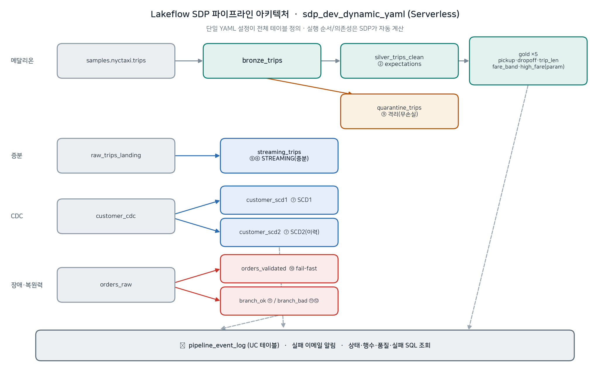
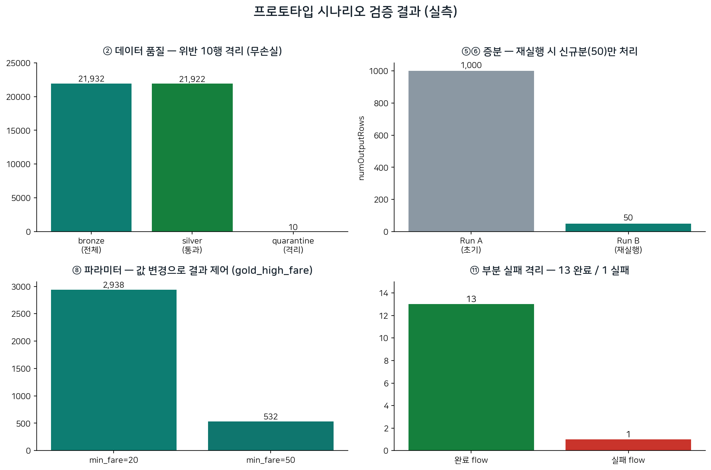

# 데이터 파이프라인 이관 프로토타입 보고서

> 컨설팅 관점의 **접근 방식·컨셉 소개용 프로토타입**입니다. 실제 데이터·요건으로 타당성을 정식 검증하는 PoC가 아니라, 샘플 데이터로 전환 방식이 어떻게 동작하는지 보여주는 동작 데모입니다.

- **프로젝트**: 데이터 파이프라인 이관 (GCP BigQuery → Azure Databricks)
- **작성일**: 2026-07-28
- **작성 환경**: MISGF76 로컬 PC
- **실행 워크스페이스**: `adb_wrkspc_krc_dev` (Azure Databricks, Serverless)

---

## 1. 개요

### 1.1 목적
GCP BigQuery 기반 데이터 파이프라인을 Azure Databricks로 이관하기 위한 방향을 결정하고, 핵심 전환 방식(Lakeflow Jobs + Lakeflow SDP)이 AsIs의 기능·장애·운영 요구를 실제로 커버하는지 **실 워크스페이스에서 실증**한다.

### 1.2 결론 요약
- 이관 성격은 단순 lift & shift가 아니라 **cross-cloud Replatform**(엔진 전환). SQL 방언·스토리지 포맷·거버넌스 도구가 모두 바뀐다.
- 오케스트레이션은 **Lakeflow Jobs**, 데이터 변환은 **Lakeflow SDP(Declarative Pipelines)** 로 전환하는 **2안(전환)** 을 권고한다. 특히 **건강데이터(PHI) 거버넌스** 관점에서 Unity Catalog 통합 이점이 결정적이다.
- **12개 시나리오 + 모니터링**을 실제 실행·검증하여, 변환·품질·증분·CDC·파라미터·장애복원·관측 요구를 SDP가 충족함을 확인했다.

---

## 2. AsIs 현황 (2026-07-27 확인)

| 영역 | 현행 |
|---|---|
| 오케스트레이션 | **GCP Cloud Composer** (관리형 Airflow) |
| 데이터 변환 | Airflow DAG의 **`BigQueryInsertJobOperator`로 실행하는 SQL**이 중심. 일부 SQL은 **YAML 설정 + 템플릿 기반 generator 스크립트로 런타임에 동적 생성** |
| 거버넌스/카탈로그 | **Dataplex API** 기반 메타데이터·태그·계보(lineage)·데이터 품질 처리 |

이관 시 난이도에 가장 큰 영향을 주는 요인은 ① SQL 물량·복잡도, ② BigQuery 전용 기능(JS UDF·BQML·저장프로시저), ③ 다운스트림 소비처 수이며, 특히 **동적 SQL 생성 로직**이 핵심 전환 포인트다.

---

## 3. 이관 방향 결정

### 3.1 3안 비교

| 구분 | 1안) Airflow 유지 (Composer → 자체 Airflow 이전) | 2안) 전환 (Lakeflow) | 3안) 하이브리드→점진 |
|---|---|---|---|
| 비용 | 높음(상시 인프라) | 낮음(서버리스, 실행 시 과금) | 중간 |
| 유지보수 | 무거움(직접 운영+이중관리) | 가벼움(관리형) | 초기 무거움→감소 |
| 확장성 | 수동, 벤더 중립 | 자동, 네이티브 | 유연 |
| **거버넌스** | 이중 도메인, 감사 분절 | **단일 UC 경계, end-to-end 통합** | 데이터층 UC, 오케스트레이션만 분절 |
| 이관 난이도 | 중간 (Airflow 인프라 Azure 재구축 + GCP operator 교체, DAG 재활용) | 높음(전면 재작성) | 중간 |

> ⚠️ **1안도 "현행 유지"가 아니다.** AsIs는 GCP **Cloud Composer(관리형 Airflow)** 이고 Azure에서는 Composer를 쓸 수 없으므로, 1안은 **오케스트레이터로 Airflow를 유지하되 Cloud Composer → 자체 구축(self-managed) Airflow(Azure AKS/VM)로 이전**하는 것이다. 즉 오케스트레이터 기술(Airflow)만 유지될 뿐, 관리형(Composer) 이점은 사라지고 운영 부담이 남는다. 이 점이 **2안(Lakeflow 전환)의 명분을 강화**한다.

### 3.2 거버넌스 세부 (건강데이터 PHI → 가중치 높음)

| 요소 | 2안(전환) | 1안 유지 / 3안 |
|---|---|---|
| 접근제어 | 테이블·행·열 + 마스킹 중앙 관리 | 데이터층은 UC, 파이프라인 권한은 Airflow RBAC 별도 |
| 리니지 | 잡·노트북·대시보드 컬럼레벨 자동 | Airflow DAG는 UC 밖 → 분절 |
| 감사 | 단일 감사 로그 | Airflow 로그 + UC 감사 2개 대사 |
| 인증/신원 | Entra ID SCIM 단일 | Airflow 자체 커넥션·시크릿 별도 |
| 분류/정책 | PII/PHI 태깅 + ABAC 강제 | 오케스트레이션 계층 미적용 |

**권고: 2안(전환).** 데이터+컴퓨트+오케스트레이션이 하나의 거버넌스 경계(Unity Catalog) 안으로 통합된다.

---

## 4. Lakeflow Jobs / SDP 개요

- **Lakeflow Jobs**(구 Databricks Workflows): 오케스트레이션. 통합 오케스트레이션, 이벤트 트리거, 조건 분기·값 전달, 복원력(Repair/재시도/백필), 서버리스, 통합 관측성, CI/CD(DAB).
- **Lakeflow SDP**(Spark/Lakeflow Declarative Pipelines): 데이터 변환. 선언형(관계만 선언 → 순서 자동 계산), 메달리온, expectations(품질), 스트리밍/증분, AUTO CDC.

핵심: AsIs의 **"주방장(오케스트레이션)이 레시피(SQL)까지 쥐고 있는" 구조**를 Jobs(오케스트레이션)와 SDP(변환)로 **역할 분리**한다.

---

## 5. 프로토타입 설계 및 환경

- **파이프라인**: `sdp_dev_dynamic_yaml` (서버리스, id `367220ef-f40a-416a-8932-adb5839d470b`)
- **카탈로그.스키마**: `adb_wrkspc_krc_dev.sdp_poc_demo` (총 13 테이블)
- **설정(YAML)**: `/Volumes/adb_wrkspc_krc_dev/sdp_poc_demo/cfg/pipelines.yaml` — 소스·테이블·품질규칙·파라미터를 단일 파일로 구동
- **원천**: `samples.nyctaxi.trips`(21,932행) 및 데모용 appendable 소스(`raw_trips_landing`, `customer_cdc`, `orders_raw`)

> 설계 의도: AsIs의 "YAML + 템플릿 + generator" 자산을 **재활용**하되, 생성 타이밍을 "실행 순간"에서 "파이프라인 정의 시점"으로 옮겨 SDP가 테이블을 **동적 생성**하도록 재구성.

### 5.1 파이프라인 아키텍처

*단일 YAML 설정이 13개 테이블을 정의하고, 실행 순서/의존성은 SDP가 자동 계산한다. (메달리온=틸, 증분·CDC=블루, 장애/복원력=레드, 격리=앰버, 모니터링=그레이)*

---

## 6. 시나리오별 검증 결과 (①~⑫ + 모니터링)

| # | 시나리오 | 핵심 동작 | 증거(실측) | 이관 갭 |
|---|---|---|---|---|
| ① | 동적 테이블 생성 | YAML 목록만큼 테이블 자동 생성 | gold 4개 자동 생성 | 명령형→선언형 |
| ② | 데이터 품질(expectations) | 규칙 위반 행 자동 드롭 | bronze 21,932 → silver 21,922 (**10 드롭**) | Dataplex DQ |
| ③ | 동적 확장 | YAML 한 줄 추가 → 테이블 증가 | `gold_by_fare_band` 추가 (<10:11,873 / 10–30:8,698 / 30+:1,351) | 운영 유연성 |
| ④ | 다층 의존성 자동 정렬 | 순서 미지정, SDP 자동 계산 | bronze→silver→gold 자동 실행 | 선언형 |
| ⑤⑥ | 스트리밍/증분 | 재실행 시 신규분만 처리 | numOutputRows **1,000 → 50** (신규만) | execution_date/백필 |
| ⑦ | CDC/SCD (AUTO CDC) | 변경분 자동 병합 | SCD1 3행(Carol 삭제 반영) · SCD2 5행(Bob 2버전 이력) | BigQuery MERGE |
| ⑧ | 파라미터화 | 파라미터로 결과 제어 | `min_fare` 20→50 = **2,938 → 532행** | 갭②(재처리) |
| ⑨ | 격리(Quarantine) | 불량 데이터 무손실 분리 | quarantine 10 · (21,922 + 10 = 21,932) | 복원력 |
| ⑩ | Fail-fast | 규칙 위반 시 즉시 중단 + 복구 | 불량(amount=-50) 주입 → **FAILED** → 제거 후 **COMPLETED** | 복원력 |
| ⑪ | 부분 실패 격리 | 장애 flow만 실패, 나머지 완료 | **13 flow 완료 / branch_bad 1개만 실패** (branch_ok 100행 커밋) | 복원력 |
| ⑫ | 자동 재시도 | 프로덕션 모드 자동 재시도 | branch_bad **3회 재시도** + MaxRetryThreshold, update 5~6회 재시도 (개발 모드는 재시도 0) | 복원력 |
| ★ | 모니터링 + 알림 | 이벤트로그 UC 테이블 + 실패 이메일 | event_log **629건** · expectation passed/failed · 실패 포착 | 통합 관측성 |

### 6.1 세부 근거

- **② 데이터 품질**: expectation별 지표 — `valid_fare` passed 21,922 / failed 10, `non_negative_distance`·`pickup_present` failed 0.
- **⑦ CDC/SCD**: 초기 3건(Alice/Bob/Carol) + 변경 3건(Bob 도시수정·Carol 삭제·Dave 신규) → SCD1은 최신 3행(Alice, Bob=Incheon, Dave), SCD2는 이력 5행(Bob Busan[닫힘]/Incheon[현재], Carol[삭제 닫힘] 포함).
- **⑤⑥ 증분 증명**: `DESCRIBE HISTORY streaming_trips` — Run A write numOutputRows=1,000, Run B write numOutputRows=50 (전량 재처리가 아니라 신규분만).

---

## 7. 장애 / 복원력 및 모니터링

### 7.1 장애 유형별 대응 (실증)
- **Fail-fast**(`expect_or_fail`): 핵심 규칙 위반 시 파이프라인 즉시 중단 → 불량 데이터가 하류로 새지 않음. 원인 제거 후 재실행으로 복구.
- **부분 실패 격리**: 개발 모드에서 한 flow(runtime 오류) 실패가 update 전체를 실패로 표시하되, **무관한 13개 flow는 정상 완료·커밋** → 장애 반경 최소화.
- **자동 재시도**: 프로덕션 모드(`development=false`)에서 장애 flow가 자동 재시도(3회) + update 레벨 재시도. 개발 모드는 즉시 실패("will not be restarted")로 디버깅 용이 → **모드별 정책 차이 확인**.

### 7.2 모니터링 방안 (실증)
- 파이프라인에 `event_log`(UC 테이블 `pipeline_event_log`) + `notifications`(실패 시 이메일) 설정.
- 이벤트로그를 **SQL로 조회**하여 다음을 관측: 실행 상태 이력, 플로우별 출력 행수, 데이터 품질(드롭·expectation passed/failed), 실패 포착.
- 즉, GCP Airflow에서 로그를 개별로 뒤지던 것을 **단일 테이블 쿼리 기반**의 대시보드·알림·SLA 모니터링으로 통합.

---

## 8. AsIs → ToBe 매핑

| AsIs (GCP) | ToBe (Azure Databricks) |
|---|---|
| Cloud Composer (Airflow) — 오케스트레이션 | **Lakeflow Jobs** |
| `BigQueryInsertJobOperator` SQL + generator | **SDP 선언형 + Python 메타프로그래밍** |
| Airflow Sensor (도착 대기) | **File / Table update 트리거** |
| execution_date · catchup · backfill | **증분 + full refresh + 파라미터** |
| Dataplex Data Quality | **SDP expectations + 격리** |
| 분산된 실행 로그 | **event_log 단일 테이블 + 알림** |
| XCom / BranchOperator | task values / conditional·run-if |

---

## 9. 기능 갭 및 대안

| 갭 | AsIs 방식 | 대안(메우는 법) |
|---|---|---|
| 동적 SQL 생성 | generator가 실행 순간 SQL 생성 | 생성 타이밍을 정의 시점으로 이동 + SDP Python 메타프로그래밍 (자산 재활용) |
| execution_date·백필 | 날짜별 판 자동 재실행(catchup) | **전진=증분**, **과거 재처리=full refresh / 파라미터 backfill**로 분리 |
| Sensor·커스텀 오퍼레이터 | 도착 대기 | 이벤트 트리거·네이티브 태스크·노트북 흡수 |

> 핵심: "증분"이 없애는 것은 **전진 처리의 날짜 루프**이며, **과거 재처리(백필)** 는 여전히 필요하되 full refresh / 파라미터 방식으로 수행된다. (증분과 full refresh를 이번 프로토타입에서 함께 확인)

---

## 10. 남은 과제 — 과제 A: Dataplex → Unity Catalog

| Dataplex | Unity Catalog / Databricks |
|---|---|
| 메타데이터/엔트리 | UC catalog·schema·table + information_schema |
| Tags / Aspect types | UC governed tags, 컬럼 태그, ABAC |
| Lineage | UC 자동 리니지 + system.access.*_lineage |
| Data Quality | SDP expectations + Lakehouse Monitoring |
| Dataplex API | Databricks REST API / UC API / databricks-sdk |

기존 Dataplex API 기반 메타데이터·태그·계보·품질 로직을 분석해 Unity Catalog + Databricks API 기반으로 전환하는 상세 가이드가 후속 과제로 남아 있다. (실제 소스 아티팩트 확보 시 실행 가능한 코드 산출)

---

## 11. 결론 및 권고

1. **2안(전환)을 권고**한다. Cloud Composer 이관 제약과 건강데이터 거버넌스 요구를 함께 고려하면 Lakeflow 전환의 이점이 크다.
2. Lakeflow SDP가 AsIs의 **변환·품질·증분·CDC·파라미터·장애복원·관측** 요구를 실제로 충족함을 **12개 시나리오 + 모니터링**으로 실증했다.
3. **동적 SQL 생성**이 최대 전환 포인트이며, generator 자산을 살리는 메타프로그래밍 재설계로 해결 가능함을 확인했다.
4. 후속으로 **과제 A(Dataplex → Unity Catalog)** 를 진행하여 거버넌스 전환을 완성한다.

---

## 부록 A. 자산 위치 / 재현

- 파이프라인: `sdp_dev_dynamic_yaml` (id `367220ef-f40a-416a-8932-adb5839d470b`)
- 카탈로그.스키마: `adb_wrkspc_krc_dev.sdp_poc_demo` (13 테이블)
- 설정 파일: `/Volumes/adb_wrkspc_krc_dev/sdp_poc_demo/cfg/pipelines.yaml`
- **파이프라인 소스·설정**: [`pipeline/`](pipeline/) — 노트북 `sdp_dynamic_pipeline.py`, 설정 `pipelines.yaml`, 스펙 `pipeline_config.json`
- 재실행: `databricks pipelines start-update 367220ef-f40a-416a-8932-adb5839d470b -p DEFAULT`
- 요약 리포트(아티팩트): https://claude.ai/code/artifact/d6d1ea9c-68cc-4769-b606-1a86c92cdbc6

## 부록 B. 참고 사항

- 최초 지정 워크스페이스(`dbx_poc_hpd6_ws`, 이름에 poc 포함)는 실행 시점에 서버리스·클래식 컴퓨트 프로비저닝이 모두 차단(RESOURCE_EXHAUSTED / Cannot create Cluster)되어, 컴퓨트가 가용한 `adb_wrkspc_krc_dev`에서 프로토타입을 수행했다. (구독 쿼터/서버리스 활성화는 관리자 확인 필요)
- 의사결정 자료(Airflow 체크리스트 / 3안 비교표 / 이관 난이도 / Lakeflow Jobs 장점)는 별도 구글시트로 정리되어 있다.
