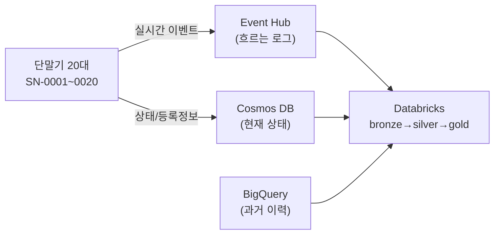

# 프로토타입 스터디 매뉴얼 — BigQuery · Event Hub · Cosmos · Lakeflow SDP

> 이 문서는 프로토타입을 **하나씩 따라가며 이해**하기 위한 학습용 매뉴얼입니다.
> 각 단계는 **개념 → 왜 이렇게 하나 → 실습(명령/코드) → 확인 → 한 줄 정리** 순서로 구성했습니다.
> 결과·아키텍처 총정리는 [`BigQuery_EventHub_Cosmos_프로토타입.md`](BigQuery_EventHub_Cosmos_프로토타입.md), 실행 코드는 [`realtime_source_proto/`](realtime_source_proto/) 참고.

## 학습 지도 (목차)

- [Part 0. 큰 그림 잡기](#part-0-큰-그림-잡기)
- [Part 1. 개념 먼저 — 왜 이런 구성인가](#part-1-개념-먼저--왜-이런-구성인가)
  - [1-1. 배치 원천 vs 실시간 원천](#1-1-배치-원천-vs-실시간-원천)
  - [1-2. Event Hub는 "흐르는 로그", Cosmos는 "현재 상태"](#1-2-event-hub는-흐르는-로그-cosmos는-현재-상태)
  - [1-3. Lakeflow SDP — 선언형 파이프라인](#1-3-lakeflow-sdp--선언형-파이프라인)
  - [1-4. Unity Catalog & Lakehouse Federation](#1-4-unity-catalog--lakehouse-federation)
- [Part 2. 실습 준비](#part-2-실습-준비)
- [Part 3. Part B 실시간 파이프라인 — 스텝별](#part-3-part-b-실시간-파이프라인--스텝별)
  - [Step B1. Azure 리소스 만들기](#step-b1-azure-리소스-만들기)
  - [Step B2. 샘플 데이터 주입](#step-b2-샘플-데이터-주입)
  - [Step B3. Cosmos → Delta 브리지](#step-b3-cosmos--delta-브리지)
  - [Step B4. Databricks 시크릿](#step-b4-databricks-시크릿)
  - [Step B5. SDP 파이프라인 뜯어보기](#step-b5-sdp-파이프라인-뜯어보기)
  - [Step B6. 실행 & 결과 읽기](#step-b6-실행--결과-읽기)
- [Part 4. Part A 배치 이관 — 스텝별](#part-4-part-a-배치-이관--스텝별)
  - [Step A1. BigQuery 샘플 warehouse](#step-a1-bigquery-샘플-warehouse)
  - [Step A2. Lakehouse Federation (제로카피)](#step-a2-lakehouse-federation-제로카피)
  - [Step A3. 배치 export → Delta](#step-a3-배치-export--delta)
- [Part 5. 겪은 오류에서 배우기 (트러블슈팅)](#part-5-겪은-오류에서-배우기-트러블슈팅)
- [Part 6. 스스로 점검 & 확장 과제](#part-6-스스로-점검--확장-과제)
- [부록. 빠른 참조](#부록-빠른-참조)

---

## Part 0. 큰 그림 잡기

우리가 만든 것은 **단말기(IoT device) 데이터를 두 갈래로 받아 하나의 Databricks 창고로 모으는** 파이프라인입니다.



- **Part B(실시간)**: 지금 들어오는 이벤트는 **Event Hub**, 단말기의 최신 상태는 **Cosmos DB** → Lakeflow SDP가 스트리밍으로 처리.
- **Part A(배치)**: 과거 이력은 **BigQuery**에 쌓여 있고, 이걸 Databricks로 이관.

> 💡 **학습 팁**: Part 1(개념)을 먼저 읽고, Part 3(실시간)부터 손으로 따라 하세요. Part A는 개념이 비슷하니 나중에 봐도 됩니다.

---

## Part 1. 개념 먼저 — 왜 이런 구성인가

### 1-1. 배치 원천 vs 실시간 원천

단말기 데이터는 성격이 두 가지입니다.

| | 배치(이력) | 실시간(스트림) |
|---|---|---|
| 예시 | "지난 30일 온도 기록 전체" | "방금 SN-0007이 23.4도 보고" |
| 저장소 | BigQuery(대용량 분석 창고) | Event Hub/Cosmos |
| 처리 | 하루 한 번 몰아서 | 들어오는 즉시 |
| 비유 | 도서관 서고 | 라이브 방송 |

**왜 나누나?** 대용량 이력을 실시간처럼 다루면 낭비고, 실시간 이벤트를 배치로 다루면 늦습니다. 그래서 원천을 성격에 맞게 두고, **Databricks에서 하나로 합칩니다**.

### 1-2. Event Hub는 "흐르는 로그", Cosmos는 "현재 상태"

이 프로토타입에서 **가장 중요한 개념**입니다. 왜 둘 다 필요한지 비유로 봅시다.

**Event Hub = 컨베이어 벨트 / 방송국**
- 이벤트가 벨트 위로 계속 흘러갑니다. 소비자(Databricks)는 벨트를 보며 지나가는 걸 읽습니다.
- 로그(log)라서 **"재생(replay)"** 가능 — 일정 보관 기간 안에서는 처음부터 다시 읽을 수 있습니다.
- 하지만 **"지금 SN-0007의 상태가 뭐지?"** 에는 답 못 합니다. 벨트는 흘러간 것만 기억하지, 현재값을 콕 집어 주지 않습니다.

**Cosmos DB = 화이트보드 / 현황판**
- 단말기별로 "현재 상태" 한 줄을 최신값으로 **덮어씁니다**(upsert).
- "SN-0007 = active, 배터리 87%, 서울" 을 **즉시 조회**할 수 있습니다.
- 대신 "과거에 어떻게 변해왔나"의 흐름은 (기본적으로) 없습니다.

> **핵심**: Event Hub = 흐르는 **이벤트(fact)**, Cosmos = 현재 **상태(state)**.
> SDP는 이벤트 스트림을 처리하면서, Cosmos의 상태를 **참조로 붙여(enrichment)** 완성합니다.

**"카프카는 상태를 어떻게 관리하나?"** → 카프카/Event Hub 브로커 자체는 **stateless 로그**입니다(오프셋만 기억). 우체국이 편지를 전달만 하고 내용을 기억하지 않는 것과 같습니다. "현재 상태"는 항상 **별도 저장소(여기선 Cosmos)** 나 소비자 쪽 상태저장(Spark state store)이 담당합니다.

**"단말기 데이터를 Event Hub 없이 Databricks에 바로 넣으면 안 되나?"** → 됩니다. 하지만 Event Hub가 중간에 있으면:
- **버퍼**: Databricks가 잠깐 죽거나 재배포 중이어도 이벤트가 안전하게 쌓입니다.
- **재생**: 오류 나면 오프셋을 되감아 다시 처리.
- **다중 소비**: 같은 스트림을 여러 소비자가 각자 읽음.
즉 Event Hub는 **완충·안전장치·분배기** 역할입니다.

### 1-3. Lakeflow SDP — 선언형 파이프라인

**SDP(Spark Declarative Pipelines)** 는 "무엇을 만들지"만 선언하면 "어떤 순서로 만들지"는 엔진이 알아서 계산합니다.

- **기존(Airflow) = 요리 순서서**: "먼저 A 삶고, 그다음 B 볶고, C를 A·B와 합쳐라"를 사람이 일일이 지정.
- **SDP = 레시피의 재료 관계만**: "silver는 bronze로 만든다, gold는 silver로 만든다"만 선언 → 실행 순서는 SDP가 그래프로 자동 계산.

여기에 3가지 무기가 붙습니다.
- **메달리온**: bronze(원석) → silver(세공) → gold(완제품). 단계별로 품질을 높여갑니다.
- **expectations(품질 검사대)**: 규칙 위반 행을 자동으로 걸러냄(drop/격리/실패).
- **스트리밍 테이블**: 새로 들어온 데이터만 증분 처리.

### 1-4. Unity Catalog & Lakehouse Federation

- **Unity Catalog(UC)**: Databricks의 거버넌스 계층. `카탈로그.스키마.테이블` 3단계로 모든 데이터·권한·계보를 관리. 우리 작업은 전부 `adb_wrkspc_krc_dev.iot_proto` 스키마 안에 모았습니다.
- **Lakehouse Federation**: 다른 시스템(BigQuery 등)을 **복사 없이** UC 테이블처럼 조회하는 기능.
  - 비유: **남의 집 냉장고를 내 주방에서 바로 꺼내 쓰기**(federation) vs **아예 내 냉장고로 옮겨담기**(배치 export).

---

## Part 2. 실습 준비

**필요한 것**
- Azure 구독 + 서비스 주체(SP, Contributor 권한) — 리소스 자동 생성용
- GCP 서비스계정(SA) 키 — BigQuery 접근용
- Databricks CLI(프로파일 설정) + Azure CLI(`az`)
- Python 패키지: `pip install azure-eventhub azure-cosmos google-cloud-bigquery`

**자격증명 구조 (⚠️ 코드/리포에 평문 금지)**

| 위치 | 내용 |
|---|---|
| `.secrets/azure-sp.json` | Azure SP(appId/password/tenant) |
| `.secrets/eventhub.json` | Event Hub 연결문자열 |
| `.secrets/cosmos.json` | Cosmos endpoint/key |
| `.secrets/google-sa.json` | GCP SA 키 |
| Databricks Secret `iot_proto/eh_conn_str` | 파이프라인 런타임용 EH 연결문자열 |

> 코드는 항상 이 파일들이나 `dbutils.secrets.get`에서 값을 읽습니다. 키가 코드에 박히지 않게 하는 것이 첫 번째 보안 습관입니다.

### Databricks에서 상태를 확인하는 3가지 방법

이 매뉴얼 곳곳의 **🔎 Databricks에서 확인** 블록은 아래 중 아무 방식으로나 실행하면 됩니다.

| 방법 | 어디서 | 쓰기 |
|---|---|---|
| **① SQL 편집기** | 워크스페이스 좌측 `SQL Editor` | SQL 그대로 붙여넣고 실행. 가장 간편 |
| **② 노트북** | 노트북 셀 | SQL은 `%sql` 매직 또는 `spark.sql("...")`, Python은 `spark.table(...)` |
| **③ CLI(API)** | 로컬 터미널 | `databricks api post /api/2.0/sql/statements ...` (본 프로토타입 `verify_pipeline.py`가 이 방식) |

```python
# 노트북에서 SQL/Python 혼용 예 (셀 하나)
spark.sql("SELECT count(*) FROM adb_wrkspc_krc_dev.iot_proto.silver_telemetry").show()
spark.table("adb_wrkspc_krc_dev.iot_proto.silver_telemetry").groupBy("metric").count().show()
```
> 아래 예제들은 카탈로그·스키마를 `adb_wrkspc_krc_dev.iot_proto`로 가정합니다. SQL 편집기에서 `USE CATALOG adb_wrkspc_krc_dev; USE SCHEMA iot_proto;` 를 먼저 실행하면 테이블명만 써도 됩니다.

---

## Part 3. Part B 실시간 파이프라인 — 스텝별

### Step B1. Azure 리소스 만들기

**개념**: 실시간 원천 2개(Event Hub, Cosmos)와 이들을 담을 리소스 그룹(RG)을 만듭니다.

**왜**: RG는 리소스를 묶는 폴더입니다. SP에 Contributor가 있으면 이 모든 걸 **명령으로 자동 생성**할 수 있습니다(수동 포털 작업 불필요).

**실습**
```bash
# 0) SP 로그인
az login --service-principal -u <appId> -p <password> --tenant <tenant>
az account set --subscription <sub-id>

# 1) 리소스 그룹
az group create -n rg-iot-proto -l koreacentral

# 2) Event Hub — 네임스페이스(Standard) + 허브(파티션 2)
az eventhubs namespace create -n ehns-iotproto-kc22 -g rg-iot-proto --sku Standard
az eventhubs eventhub create -n device-telemetry --namespace-name ehns-iotproto-kc22 -g rg-iot-proto --partition-count 2

# 3) Cosmos — Serverless 계정 + DB + 컨테이너
az cosmosdb create -n cosmos-iotproto-kc22 -g rg-iot-proto --locations regionName=koreacentral --capabilities EnableServerless
az cosmosdb sql database  create -a cosmos-iotproto-kc22 -g rg-iot-proto -n iotdb
az cosmosdb sql container create -a cosmos-iotproto-kc22 -g rg-iot-proto -d iotdb -n device_state --partition-key-path /device_id
```

**옵션 해설**
- `--sku Standard`: Event Hub 등급. Standard는 컨슈머 그룹·7일 보관 등 지원(Basic은 1일). 최소 1 TU 고정 과금.
- `--partition-count 2`: 허브를 2개 파티션으로 → 병렬 처리 단위. (많을수록 병렬↑, 순서는 파티션 내에서만 보장)
- `--capabilities EnableServerless`: Cosmos를 서버리스로 → **쓴 만큼만 과금**(유휴 시 거의 0원).
- `--partition-key-path /device_id`: Cosmos가 데이터를 분산·조회하는 기준 키. 단말기별 조회가 많으니 device_id로.

**확인**: 각 명령이 `"provisioningState": "Succeeded"` 를 반환하면 성공. 연결정보는 아래로 확보:
```bash
# Event Hub 연결문자열
az eventhubs namespace authorization-rule keys list -g rg-iot-proto \
  --namespace-name ehns-iotproto-kc22 --authorization-rule-name RootManageSharedAccessKey \
  --query primaryConnectionString -o tsv
# Cosmos endpoint / key
az cosmosdb show      -n cosmos-iotproto-kc22 -g rg-iot-proto --query documentEndpoint -o tsv
az cosmosdb keys list -n cosmos-iotproto-kc22 -g rg-iot-proto --query primaryMasterKey -o tsv
```

> **한 줄 정리**: RG 안에 Event Hub(스트림 버퍼)와 Cosmos(상태 저장소)를 만들고, 연결정보를 `.secrets/`에 저장한다.

---

### Step B2. 샘플 데이터 주입

**개념**: 단말기가 있는 것처럼 **가짜 텔레메트리**를 Event Hub로 흘려보내고, 단말기 상태를 Cosmos에 씁니다.

**왜**: 파이프라인을 테스트하려면 원천에 데이터가 있어야 합니다. 특히 **일부러 불량 데이터를 섞어** 품질 검사(expectations)가 작동하는지 봅니다.

**실습 — Event Hub 주입** ([`02_inject_eventhub.py`](realtime_source_proto/02_inject_eventhub.py))
```python
from azure.eventhub import EventHubProducerClient, EventData
producer = EventHubProducerClient.from_connection_string(conn_str, eventhub_name="device-telemetry")

evt = {"device_id":"SN-0007","event_ts":"...","metric":"temperature",
       "value":23.4,"unit":"C","battery_pct":86,"rssi":-72,"seq":1421}

with producer:
    batch = producer.create_batch()
    batch.add(EventData(json.dumps(evt)))   # 이벤트를 배치에 담고
    producer.send_batch(batch)              # 한 번에 전송
```
- 총 600건을 보내되 **~6%를 불량**으로: `device_id=null`(12건), 범위초과 값(14건), 음수 배터리(11건). → 나중에 정확히 이 숫자가 격리되는지로 검증합니다.

**실습 — Cosmos 주입** ([`01_inject_cosmos.py`](realtime_source_proto/01_inject_cosmos.py))
```python
from azure.cosmos import CosmosClient
cont = CosmosClient(endpoint, key).get_database_client("iotdb").get_container_client("device_state")

doc = {"id":"SN-0007", "device_id":"SN-0007",   # id는 Cosmos 필수, device_id는 파티션 키
       "model":"EnvSense-X2","region":"KR-Seoul","status":"active","battery_pct":87, ...}
cont.upsert_item(doc)     # 있으면 덮어쓰기, 없으면 삽입 = "현재 상태" 갱신
```
- `upsert_item`이 핵심: Cosmos는 "현재 상태" 저장소라 **덮어쓰기**가 자연스럽습니다.

**확인**
```bash
python 01_inject_cosmos.py     # → "Cosmos ... 20 devices"
python 02_inject_eventhub.py   # → "600 events ... {'good':563,'out_of_range':14,'neg_battery':11,'null_id':12}"
```

> **한 줄 정리**: Event Hub엔 이벤트 스트림(불량 포함)을, Cosmos엔 단말기 현재 상태를 넣는다. 불량 개수를 기억해 두면 검증의 정답지가 된다.

---

### Step B3. Cosmos → Delta 브리지

**개념**: Cosmos의 단말기 상태를 Databricks가 조인할 수 있게 **Delta 참조 테이블(`device_reference`)** 로 스냅샷을 뜹니다.

**왜 (중요)**: **서버리스 SDP는 커스텀 커넥터 JAR을 못 올립니다.** Cosmos를 Spark에서 직접 읽으려면 Azure Cosmos Spark 커넥터(JAR)가 필요한데, 서버리스에선 제약이 있습니다. 그래서 우회로:
- Python `azure-cosmos` SDK로 Cosmos를 읽어(로컬),
- 그 값을 SQL로 Delta 테이블에 심습니다(브리지).

이건 **참조/차원 데이터**에 적합한 표준 패턴입니다. (상태 변화 자체를 실시간으로 받아야 하면 → Part 5의 Change Feed로 승격)

**실습** ([`03_cosmos_to_delta.py`](realtime_source_proto/03_cosmos_to_delta.py))
```python
# 1) Cosmos에서 전량 읽기
docs = list(cont.query_items("SELECT c.device_id,c.model,c.region,... FROM c",
                             enable_cross_partition_query=True))
# 2) 리터럴 VALUES로 Delta 테이블 생성 (커넥터 불필요!)
ctas = "CREATE OR REPLACE TABLE ...device_reference AS SELECT * FROM (VALUES (...),(...)) AS t(cols)"
# 3) Databricks SQL Statement Execution API로 실행
```
- 20건짜리 참조 데이터라 `VALUES` 리터럴로 심는 게 가장 단순하고 커넥터도 필요 없습니다.

**🔎 Databricks에서 확인**
```sql
-- 참조 테이블이 제대로 만들어졌나
SELECT count(*) AS devices, count(DISTINCT region) AS regions
FROM adb_wrkspc_krc_dev.iot_proto.device_reference;                 -- 기대: 20, 4

SELECT device_id, model, region, status
FROM adb_wrkspc_krc_dev.iot_proto.device_reference
ORDER BY device_id LIMIT 5;

-- 테이블에 남긴 출처 메타데이터 확인 (TBLPROPERTIES)
SHOW TBLPROPERTIES adb_wrkspc_krc_dev.iot_proto.device_reference;   -- source=cosmosdb.device_state
```
```python
# Python(PySpark)으로도 동일 확인
ref = spark.table("adb_wrkspc_krc_dev.iot_proto.device_reference")
print("devices:", ref.count())
ref.groupBy("region").count().show()
```

> **한 줄 정리**: 서버리스 JAR 제약을 우회해, Cosmos 상태를 Delta 참조테이블로 스냅샷한다. 조인용 "현황판 사본".

---

### Step B4. Databricks 시크릿

**개념**: 파이프라인이 런타임에 Event Hub 연결문자열을 안전하게 읽도록 **Databricks Secret**에 저장합니다.

**왜**: SDP 노트북은 Databricks 위에서 돕니다. 연결문자열을 코드에 박으면 유출 위험 → 시크릿 스코프에 넣고 `dbutils.secrets.get`으로 참조합니다.

**실습**
```bash
databricks secrets create-scope iot_proto
# 특수문자 안전하게 stdin으로 전달
databricks secrets put-secret iot_proto eh_conn_str   # (연결문자열 입력)
databricks secrets list-secrets iot_proto             # 확인
```

> **한 줄 정리**: 연결문자열은 시크릿으로. 코드엔 `dbutils.secrets.get("iot_proto","eh_conn_str")`만 남긴다.

---

### Step B5. SDP 파이프라인 뜯어보기

이 프로토타입의 **심장**입니다. 노트북 한 개([`04_sdp_eventhub_pipeline.py`](realtime_source_proto/04_sdp_eventhub_pipeline.py))가 메달리온 테이블들을 선언합니다. 하나씩 봅니다.

**① bronze — Event Hub에서 원본 그대로 받기**
```python
@dlt.table(name="bronze_telemetry")
def bronze_telemetry():
    return (spark.readStream.format("kafka")                      # Event Hub를 Kafka로 읽음
        .option("kafka.bootstrap.servers", "ehns-...:9093")      # Event Hub의 Kafka 엔드포인트(:9093)
        .option("subscribe", "device-telemetry")                 # 읽을 허브 이름
        .option("kafka.security.protocol", "SASL_SSL")           # 암호화 + 인증
        .option("kafka.sasl.mechanism", "PLAIN")
        .option("kafka.sasl.jaas.config", JAAS)                  # 아래 JAAS 문자열로 인증
        .option("startingOffsets", "earliest")                   # 처음부터 전부 읽기
        .load().select(F.col("value").cast("string").alias("raw_json"), ...))
```
- **왜 Kafka 포맷?** Event Hub는 Kafka 프로토콜 호환 엔드포인트(`:9093`)를 줍니다. 그래서 **커스텀 라이브러리 없이** Spark 내장 kafka 소스로 읽습니다 → 서버리스에서도 OK.
- **JAAS 문자열** = Event Hub 인증 정보:
  ```python
  JAAS = ('kafkashaded.org.apache.kafka.common.security.plain.PlainLoginModule '
          f'required username="$ConnectionString" password="{CONN}";')
  ```
  - `username`은 리터럴 `$ConnectionString`(Event Hub 규약), `password`는 연결문자열.
  - 클래스명 앞의 `kafkashaded.`가 포인트 — Databricks 런타임은 kafka 라이브러리를 shade(재패키징)하므로 이 접두어가 필요합니다.
- bronze는 **가공하지 않고** raw JSON + 오프셋/파티션/enqueue 시각만 보관 → "원석".

**② silver — 파싱 + 품질 통과분만**
```python
RANGE_EXPR = ("value IS NOT NULL AND ("
   "(metric='temperature' AND value BETWEEN -50 AND 100) OR "
   "(metric='humidity'    AND value BETWEEN 0 AND 100) OR "
   "(metric='co2'         AND value BETWEEN 300 AND 5000) OR "
   "(metric='vibration'   AND value BETWEEN 0 AND 100))")
RULES = {"valid_device_id":"device_id IS NOT NULL",
         "value_in_metric_range": RANGE_EXPR,
         "battery_non_negative":"battery_pct >= 0"}

@dlt.table(name="silver_telemetry")
@dlt.expect_all_or_drop(RULES)          # 규칙 위반 행은 자동 drop
def silver_telemetry():
    return (dlt.read_stream("bronze_telemetry")
        .select(F.from_json("raw_json", SCHEMA).alias("j"), ...)   # JSON 문자열 → 컬럼
        .select("j.*", ...).withColumn("event_ts", F.to_timestamp("event_ts")))
```
- `from_json`으로 raw JSON을 실제 컬럼으로 펼칩니다.
- `@dlt.expect_all_or_drop`: 세 규칙을 **모두 만족하는 행만** 통과, 나머지는 버림.
- **왜 metric별 범위인가?** 처음엔 전역 `±5000` 한 규칙이었는데, 습도가 451%처럼 물리적으로 불가능한 값이 통과했습니다. metric마다 물리 범위가 다르므로(습도 0~100, CO₂ 300~5000...) **항목별 범위**로 정교화 → 불량을 정확히 포착.

**③ quarantine — 불량을 버리지 말고 격리**
```python
@dlt.table(name="silver_quarantine")
def silver_quarantine():
    return (dlt.read_stream("bronze_telemetry").select(...)
        .filter(f"NOT(device_id IS NOT NULL AND ({RANGE_EXPR}) AND battery_pct >= 0)")  # 위반만
        .withColumn("quarantine_reason",
            F.when(F.col("device_id").isNull(), "null_device_id")
             .when(F.expr(f"NOT({RANGE_EXPR})"), "value_out_of_range")
             .when(F.col("battery_pct") < 0, "negative_battery").otherwise("other")))
```
- silver가 "통과"라면 quarantine은 "탈락 창고" — 불량을 **사유와 함께** 보관해 원인 분석·재처리에 씁니다.
- 비유: 품질 검사대에서 불량품을 폐기하지 않고 **불량 원인표를 붙여 별도 선반**에.

**④ silver_enriched — Cosmos 참조 붙이기(stream-static join)**
```python
@dlt.table(name="silver_enriched")
def silver_enriched():
    tele = dlt.read_stream("silver_telemetry")                   # 흐르는 이벤트(스트림)
    ref  = spark.read.table("...device_reference")               # 고정된 참조(Cosmos 스냅샷)
    return tele.join(F.broadcast(ref), "device_id", "left").select(...)
```
- **stream-static join**: 스트림(텔레메트리) + 정적 테이블(단말기 참조)을 device_id로 조인 → 이벤트에 model/region/status를 붙입니다.
- `F.broadcast(ref)`: 참조가 작으니(20행) 각 노드에 복사해 조인을 빠르게.
- 여기서 **Event Hub(이벤트) + Cosmos(상태)가 하나로 합쳐집니다** — Part 1의 개념이 코드로 실현되는 지점.

**⑤ gold — 집계(대시보드용)**
```python
@dlt.table(name="gold_region_metric")
def gold_region_metric():
    return (dlt.read("silver_enriched")                          # dlt.read = 전량 배치 읽기
        .groupBy("region","metric")
        .agg(F.count("*").alias("readings"), F.avg("value"), F.min("value"), F.max("value"), ...))
```
- `dlt.read`(배치) vs `dlt.read_stream`(증분)의 차이: gold는 집계라 전량을 다시 계산하는 **Materialized View**로 만듭니다.
- region×metric으로 묶어 평균/최대/최소 등 완제품 지표 산출.

**의존 관계 요약** (SDP가 자동 계산하는 실행 순서)
```
bronze ─┬─▶ silver ─────────────┐
        └─▶ quarantine           ├─▶ enriched ─▶ gold
device_reference ────────────────┘
```

> **한 줄 정리**: bronze(원석)→silver(품질통과)+quarantine(격리)→enriched(Cosmos 조인)→gold(집계). 순서는 선언만 하면 SDP가 알아서 실행.

---

### Step B6. 실행 & 결과 읽기

**실습**
```bash
python realtime_source_proto/run_pipeline.py     # 노트북 업로드→파이프라인 생성→full refresh 실행
python realtime_source_proto/verify_pipeline.py  # 결과 검증
```
`run_pipeline.py`는 (1) 노트북을 워크스페이스에 올리고 (2) 파이프라인을 만들고 (3) 실행하며 상태를 폴링합니다. `WAITING_FOR_RESOURCES → INITIALIZING → RUNNING → COMPLETED` 순으로 진행됩니다.

**결과 읽는 법 (정답지와 대조)**
```
bronze_telemetry   = 600     ← Event Hub에 넣은 전체
silver_telemetry   = 563     ← 품질 통과
silver_quarantine  =  37     ← 격리   (563 + 37 = 600 ✅)
격리 사유: out_of_range 14 · null_id 12 · neg_battery 11   ← 주입한 불량과 정확히 일치 ✅
```
- **검증의 핵심**은 `bronze = silver + quarantine` 이 성립하고, 격리 사유별 개수가 **Step B2에서 주입한 불량 개수와 일치**하는지입니다. 일치하면 품질 규칙이 정확히 작동한 것.
- gold의 max값이 물리 범위 안(습도≤100, 진동≤50)이면 metric별 규칙이 제대로 걸러낸 증거입니다.

**🔎 Databricks에서 확인 — 직접 쿼리로 대조하기** (SQL 편집기에 붙여넣기)
```sql
USE CATALOG adb_wrkspc_krc_dev; USE SCHEMA iot_proto;

-- ① 메달리온 행수: 등식 bronze = silver + quarantine 성립하나?
SELECT
  (SELECT count(*) FROM bronze_telemetry)   AS bronze,
  (SELECT count(*) FROM silver_telemetry)   AS silver,
  (SELECT count(*) FROM silver_quarantine)  AS quarantine,
  (SELECT count(*) FROM silver_enriched)    AS enriched;          -- 기대: 600 / 563 / 37 / 563

-- ② 격리 사유별 개수 = 주입한 불량 개수와 일치?
SELECT quarantine_reason, count(*) AS n
FROM silver_quarantine GROUP BY quarantine_reason ORDER BY n DESC; -- out_of_range 14·null_id 12·neg_battery 11

-- ③ Cosmos 조인이 붙었나 (region/model은 Cosmos에서 온 컬럼)
SELECT region, count(*) readings, count(DISTINCT device_id) devices
FROM silver_enriched GROUP BY region ORDER BY readings DESC;

-- ④ gold 집계 — max값이 물리 범위 안인지 (규칙이 제대로 걸렀는지)
SELECT region, metric, readings, avg_value, min_value, max_value, avg_battery
FROM gold_region_metric ORDER BY readings DESC LIMIT 8;
```

**🔎 데이터 품질 지표(event_log)** — expectation별 통과/실패 건수는 파이프라인 이벤트 로그에 남습니다.
```sql
-- silver_telemetry의 expectations 통과/실패 (drop된 실제 건수)
SELECT e.name AS rule, e.passed_records AS passed, e.failed_records AS failed
FROM (
  SELECT explode(from_json(
    details:flow_progress:data_quality:expectations,
    'array<struct<name:string,passed_records:long,failed_records:long>>')) e
  FROM event_log(TABLE(iot_proto.silver_telemetry))
  WHERE details:flow_progress:data_quality IS NOT NULL
) ORDER BY failed DESC;
-- 기대: valid_device_id failed 12 · battery_non_negative failed 11 · value_in_metric_range failed 14
```

**🔎 Python(PySpark)으로 등식 검증**
```python
cat = "adb_wrkspc_krc_dev.iot_proto"
b = spark.table(f"{cat}.bronze_telemetry").count()
s = spark.table(f"{cat}.silver_telemetry").count()
q = spark.table(f"{cat}.silver_quarantine").count()
print(f"bronze={b}, silver={s}, quarantine={q}, 등식성립={b == s + q}")   # True 여야 정상
spark.table(f"{cat}.silver_quarantine").groupBy("quarantine_reason").count().show()
```

**🔎 증분(스트리밍) 동작 관찰** — 스트리밍 테이블은 재실행 시 신규분만 처리합니다.
```sql
-- 각 update가 몇 행을 새로 썼는지 (numOutputRows) → 전량 재처리가 아님을 확인
DESCRIBE HISTORY iot_proto.silver_telemetry;
```

> **한 줄 정리**: `bronze = silver + 격리`, 그리고 격리 개수 = 주입 불량 개수. 이 등식이 맞으면 파이프라인이 정확히 동작한 것. event_log로 규칙별 실패 건수까지 확인.

---

## Part 4. Part A 배치 이관 — 스텝별

### Step A1. BigQuery 샘플 warehouse

**개념**: 이관의 **원천(AsIs)** 역할로, BigQuery에 이력 데이터를 만듭니다.

**실습** ([`05_bq_sample.py`](realtime_source_proto/05_bq_sample.py)): `google-cloud-bigquery`로 데이터셋 `iot_proto` + 테이블 2개 생성.
- `device_telemetry_history`(사실, 2400행, `ingest_date`로 파티션) + `device_catalog`(차원, 20행).
- Part B와 **같은 단말기(SN-0001~0020)** 를 써서 하나의 서사로 연결.

> **한 줄 정리**: BigQuery = 옮겨올 원천 창고. 사실 테이블 + 차원 테이블로 구성.

### Step A2. Lakehouse Federation (제로카피)

**개념**: BigQuery를 **복사하지 않고** Databricks에서 UC 테이블처럼 직접 조회.

**왜**: 이관 초기엔 원천과 대상을 **병행 운영**하며 검증해야 합니다. Federation이면 데이터 이동 없이 즉시 비교 가능.

**실습** ([`06_federation_setup.py`](realtime_source_proto/06_federation_setup.py))
```python
# 1) UC Connection (BigQuery SA 키를 자격증명으로) — API로 생성해 SQL 이스케이프 회피
POST /api/2.1/unity-catalog/connections
  {"name":"bq_iot_conn","connection_type":"BIGQUERY","options":{"GoogleServiceAccountKeyJson": "<json>"}}
# 2) Foreign Catalog (BigQuery 프로젝트 매핑)
POST /api/2.1/unity-catalog/catalogs
  {"name":"bq_iot_fed","connection_name":"bq_iot_conn","options":{"dataProjectId":"myproject-493803"}}
```
**🔎 Databricks에서 확인 — BigQuery를 UC 테이블처럼 조회**
```sql
-- Foreign Catalog 안에 BigQuery 데이터셋/테이블이 보이나
SHOW SCHEMAS IN bq_iot_fed;                                  -- iot_proto 등
SHOW TABLES  IN bq_iot_fed.iot_proto;                        -- device_telemetry_history, device_catalog

-- 라이브 조회 (데이터 이동 없이!) — 집계는 BigQuery로 pushdown
SELECT count(*) FROM bq_iot_fed.iot_proto.device_telemetry_history;          -- → 2400
SELECT metric, count(*) c, round(avg(value),2) avg
FROM bq_iot_fed.iot_proto.device_telemetry_history GROUP BY metric ORDER BY c DESC;
```
```python
# Python으로도 그대로 조회 가능
spark.table("bq_iot_fed.iot_proto.device_catalog").show(5)
```
- **주의점 2가지** (Part 5 트러블슈팅에서 겪음):
  - 옵션명은 `project_id`가 아니라 **`dataProjectId`**.
  - 집계(count) 같은 **pushdown**은 잘 되지만, 전량 `SELECT *`(BigQuery Storage Read API)는 SA에 `roles/bigquery.readSessionUser` 권한이 필요.

> **한 줄 정리**: Connection + Foreign Catalog면 BigQuery를 복사 없이 조회. 병행운영·검증에 최적.

### Step A3. 배치 export → Delta

**개념**: 실제 이관 — BigQuery 데이터를 꺼내 **UC Volume(오브젝트 스토리지 랜딩)** 에 두고 Delta로 적재.

**왜**: 최종적으로는 원천 의존을 끊고 Delta 네이티브 성능·비용으로 가져가야 합니다. 실무의 "GCS export → COPY INTO" 패턴을 UC Volume으로 재현.

**실습** ([`07_bq_export_load.py`](realtime_source_proto/07_bq_export_load.py))
```python
# 1) BigQuery → 로컬 NDJSON (SA 키만으로 가능)
for r in bq.query("SELECT ... FROM device_telemetry_history").result(): f.write(json.dumps(dict(r))+"\n")
# 2) UC Volume에 업로드
databricks fs cp bq_telemetry.json dbfs:/Volumes/adb_wrkspc_krc_dev/iot_proto/landing/
# 3) read_files로 Delta 생성 (타입 캐스팅)
CREATE OR REPLACE TABLE bq_telemetry_bronze AS
SELECT device_id, CAST(event_ts AS TIMESTAMP) event_ts, ... FROM read_files('.../bq_telemetry.json', format=>'json')
```
**🔎 Databricks에서 확인 — 원천(BigQuery) ↔ 이관(Delta) 대조**
```sql
USE CATALOG adb_wrkspc_krc_dev; USE SCHEMA iot_proto;

-- 행수 일치? (federation으로 원천을 동시에 조회해 한 번에 비교)
SELECT
  (SELECT count(*) FROM bq_iot_fed.iot_proto.device_telemetry_history) AS bigquery_src,
  (SELECT count(*) FROM bq_telemetry_bronze)                           AS delta_migrated; -- 2400 = 2400

-- 이관된 Delta에서 조인 집계
SELECT c.region, count(*) readings, round(avg(t.value),2) avg_val
FROM bq_telemetry_bronze t JOIN bq_device_catalog c USING(device_id)
GROUP BY c.region ORDER BY readings DESC;

-- Delta 트랜잭션 이력 (언제/몇 행 적재됐는지)
DESCRIBE HISTORY bq_telemetry_bronze;

-- 랜딩 Volume에 올린 원본 파일 확인
LIST '/Volumes/adb_wrkspc_krc_dev/iot_proto/landing';
```

> **한 줄 정리**: 꺼내서(Volume 랜딩) 담는다(read_files→Delta). 행수가 원천과 일치하면 이관 성공. federation으로 원천·대상을 한 쿼리에서 대조할 수 있다.

---

## Part 5. 겪은 오류에서 배우기 (트러블슈팅)

> 실제로 부딪힌 오류들입니다. **오류를 이해하는 것이 가장 빠른 학습**입니다.

| 증상 | 원인 | 해결 | 배우는 점 |
|---|---|---|---|
| POC 워크스페이스에서 컴퓨트 생성 즉시 실패(`RESOURCE_EXHAUSTED`) | 구독/쿼터 레벨 차단 | 컴퓨트 가용한 워크스페이스(`adb_wrkspc_krc_dev`)로 이동 | 스펙이 아니라 **구독 쿼터**가 원인일 수 있다 |
| Foreign Catalog 생성 실패 — `project_id` 미지원 | BigQuery 페더레이션 옵션명 상이 | **`dataProjectId`** 로 교체 | 커넥터마다 옵션명이 다르다. 에러가 지원 옵션 목록을 알려준다 |
| `SELECT *` 실패 — `bigquery.readsessions.create` 권한 없음 | Storage Read API 권한 부족 | SA에 `roles/bigquery.readSessionUser` 부여(또는 배치 export 우회) | 집계 pushdown ≠ 전량 read. 권한 범위가 다르다 |
| gold에 습도 451% 같은 값 통과 | 전역 `±5000` 규칙이 느슨 | metric별 물리 범위 규칙으로 정교화 | 품질 규칙은 **도메인 지식**을 반영해야 한다 |
| Cosmos를 서버리스 SDP에서 직접 못 읽음 | 서버리스 커스텀 JAR 제약 | 스냅샷 **브리지**로 우회(또는 클래식+커넥터) | 플랫폼 제약을 아키텍처로 우회하는 법 |
| Event Hub 연결문자열 조회 실패 | `-n` 플래그 오인식 | `--authorization-rule-name` 명시 | CLI 플래그는 축약형이 안 통할 때가 있다 |
| Kafka JAAS 인증 클래스 못 찾음(잠재) | Databricks는 kafka를 shade | 클래스명에 `kafkashaded.` 접두어 | 런타임이 라이브러리를 재패키징할 수 있다 |

---

## Part 6. 스스로 점검 & 확장 과제

**개념 확인 (스스로 답해보기)**
1. Event Hub와 Cosmos의 역할 차이를 한 문장으로?
2. Event Hub 없이 단말기를 Databricks에 직접 넣으면 무엇을 잃는가?
3. `dlt.read_stream`과 `dlt.read`는 언제 각각 쓰나?
4. `bronze = silver + quarantine` 등식이 왜 검증의 핵심인가?
5. Federation과 배치 export는 각각 언제 쓰는가?

**확장 과제 (다음 단계로)**
- **Cosmos Change Feed**: 참조 스냅샷 대신, 상태 변화 자체를 실시간 CDC로 받기 → **클래식 컴퓨트 + Cosmos Spark 커넥터**의 `spark.readStream.format("cosmos.oltp.changeFeed")`.
- **연속 실행**: `continuous=true`로 상시 스트리밍(현재는 트리거 1회).
- **CDC/SCD**: `dlt.apply_changes`로 단말기 상태 이력을 SCD2로 관리.
- **워터마크·중복 제거**: 지연/중복 이벤트를 `event_ts` 워터마크 + `dropDuplicates(seq)`로 처리.
- **거버넌스 연계**: silver_enriched에 PII/분류 태그를 붙여 ABAC·마스킹 적용(과제 A: Dataplex→UC 참고).

---

## 부록. 빠른 참조

**리소스 인벤토리**

| 클라우드 | 리소스 | 이름 |
|---|---|---|
| Azure | RG | `rg-iot-proto` (koreacentral) |
| Azure | Event Hub NS/Hub | `ehns-iotproto-kc22` / `device-telemetry` |
| Azure | Cosmos acct/db/container | `cosmos-iotproto-kc22` / `iotdb` / `device_state` |
| GCP | BigQuery dataset | `myproject-493803.iot_proto` |
| Databricks | UC schema | `adb_wrkspc_krc_dev.iot_proto` |
| Databricks | SDP pipeline | `iot_proto_eventhub_sdp` (serverless, triggered) |
| Databricks | Foreign Catalog | `bq_iot_fed` |

**코드 실행 순서**

| 순서 | 파일 | 한 일 |
|---|---|---|
| B1 | (az 명령) | Azure 리소스 |
| B2 | `01_inject_cosmos.py` · `02_inject_eventhub.py` | 샘플 주입 |
| B3 | `03_cosmos_to_delta.py` | Cosmos→Delta 브리지 |
| B4 | (databricks secrets) | 시크릿 |
| B5·B6 | `04_sdp_eventhub_pipeline.py` → `run_pipeline.py` → `verify_pipeline.py` | SDP 실행·검증 |
| A1 | `05_bq_sample.py` | BigQuery 샘플 |
| A2 | `06_federation_setup.py` | Federation |
| A3 | `07_bq_export_load.py` | 배치 이관 |

**핵심 명령 모음**
```bash
# 재실행(파이프라인만)
databricks pipelines start-update b6faf54c-6845-45f7-b6c6-95959724dbe6 -p DEFAULT
# 결과 조회 예
#   SELECT count(*) FROM adb_wrkspc_krc_dev.iot_proto.silver_telemetry
#   SELECT quarantine_reason, count(*) FROM ...silver_quarantine GROUP BY 1
# 비용 정리(전체 삭제)
az group delete -n rg-iot-proto --yes --no-wait
```

**상태 확인 도구 치트시트** — "지금 상태가 어떻지?" 를 물을 때 쓰는 쿼리들

| 알고 싶은 것 | 쿼리 |
|---|---|
| 테이블 스키마/코멘트 | `DESCRIBE EXTENDED iot_proto.silver_enriched` |
| 테이블 속성(출처 등) | `SHOW TBLPROPERTIES iot_proto.bq_telemetry_bronze` |
| Delta 변경 이력·증분 | `DESCRIBE HISTORY iot_proto.silver_telemetry` |
| 스키마 내 테이블 목록 | `SHOW TABLES IN iot_proto` |
| 컬럼 메타(전체) | `SELECT * FROM system.information_schema.columns WHERE table_schema='iot_proto'` |
| 파이프라인 이벤트/품질 | `SELECT * FROM event_log(TABLE(iot_proto.silver_telemetry)) ORDER BY timestamp DESC` |
| 테이블 계보(리니지) | `SELECT * FROM system.access.table_lineage WHERE target_table_schema='iot_proto'` |
| Foreign Catalog 목록 | `SHOW CATALOGS` · `SHOW SCHEMAS IN bq_iot_fed` |

```sql
-- 예: iot_proto 스키마의 모든 테이블 행수를 한눈에 (information_schema 활용)
SELECT table_name FROM system.information_schema.tables
WHERE table_catalog='adb_wrkspc_krc_dev' AND table_schema='iot_proto' ORDER BY table_name;
```
> `system.*`·`event_log`은 거버넌스/모니터링의 출발점입니다. 과제 A(Dataplex→UC)에서 이 테이블들로 메타데이터·태그·계보·품질을 검증했습니다.

---

*이 매뉴얼은 중립 IoT 샘플로 컨셉을 학습하기 위한 것입니다. 실제 이관 설계 시에는 데이터 규모·보안·네트워킹·규제 요건을 추가로 반영합니다.*
